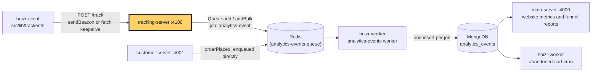
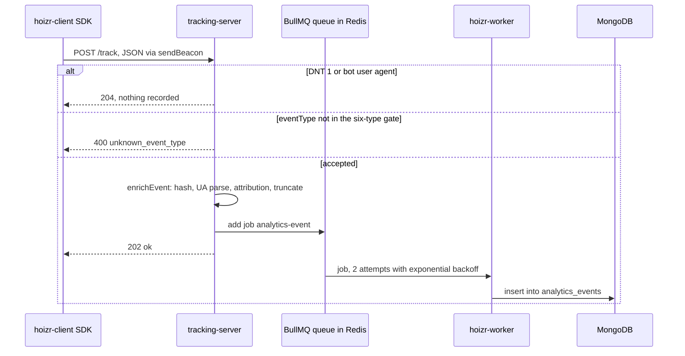
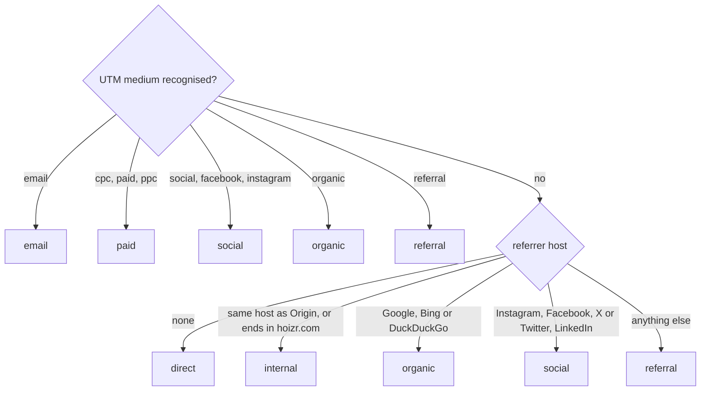

<div align="center">

# Hoizr tracking-server

Write-only analytics ingest for Hoizr: filters and enriches storefront events, queues them to BullMQ, keeps no raw IPs.

[Hoizr walkthrough](https://github.com/Hoizr-Technology/hoizr-walkthrough) · [Architecture](https://github.com/Hoizr-Technology/hoizr-walkthrough/blob/main/docs/01-system-architecture.md) · [Local setup](https://github.com/Hoizr-Technology/hoizr-walkthrough/blob/main/docs/09-local-development.md) · [Contributing](https://github.com/Hoizr-Technology/.github/blob/main/CONTRIBUTING.md)

[](LICENSE)
[](https://fastify.dev/docs/latest/)
[](https://docs.bullmq.io/)
[](https://www.typescriptlang.org/docs/)
[](https://nodejs.org/en/docs)

</div>

## Where this fits



The customer storefront posts behaviour events to this service. tracking-server filters and enriches each event, then pushes it onto a BullMQ queue in Redis. It never talks to MongoDB: the `hoizr-worker` process drains the queue and writes one document per event. `customer-server` puts server-side `orderPlaced` conversions onto the same queue directly, without calling this service. Reports in `main-server` and an abandoned-cart cron in `hoizr-worker` read the stored events.

## About

Hoizr is an event ticketing, fan CRM, marketing and door-scanning platform for venues and event organizers in India. This repository is its analytics ingest edge: a small Fastify process (four TypeScript files) that accepts page views and checkout-funnel events from the customer storefront, drops Do-Not-Track and bot traffic, and turns each request into a compact, privacy-reduced record on a queue. It reads each visitor's raw IP address from the request and uses it only as an input to a salted, daily-rotating hash.

It runs as its own process so that a high-write, no-read surface stays off the GraphQL servers' hot path and keeps accepting beacons while those servers deploy ([src/index.ts](src/index.ts)). For the full system, start with the [Hoizr walkthrough](https://github.com/Hoizr-Technology/hoizr-walkthrough).

## Contents

- [Where this fits](#where-this-fits)
- [About](#about)
- [Highlights](#highlights)
- [Features](#features)
- [Tech stack](#tech-stack)
- [Architecture](#architecture)
- [API and event reference](#api-and-event-reference)
- [Getting started](#getting-started)
- [Testing and quality](#testing-and-quality)
- [Known limitations](#known-limitations)
- [Contributing](#contributing)
- [Related repositories](#related-repositories)
- [Author](#author)
- [License](#license)

## Highlights

- **Derive, then drop.** The raw IP only ever enters a SHA-256 hash. The User-Agent is reduced to device class, browser name and OS name, and the referrer to its hostname. The output is built from an explicit field allow-list, so unknown body keys never reach the queue: [src/utils/enrich.ts](src/utils/enrich.ts).
- **Cookieless daily visitor hash.** `sha256(salt | UTC date | ip | userAgent)`, truncated to 32 hex characters, gives "unique visitors per day" with no long-lived identifier. Rotating `VISITOR_HASH_SALT` makes every earlier hash unlinkable: [`visitorHashOf`](src/utils/enrich.ts#L60-L67).
- **A six-type ingest gate.** Only `pageView`, `cartCreated`, `cartDestroyed`, `paymentStarted`, `paymentFailed` and `orderPlaced` are accepted. Anything else is rejected before enrichment, so a stale or buggy client cannot widen the event catalogue: [src/utils/enrich.ts](src/utils/enrich.ts#L22-L29).
- **Consent and noise handled at the edge.** A `DNT: 1` header or a User-Agent matching one of 17 crawler, headless-browser and uptime-monitor hints gets an empty `204` before any enrichment or Redis work: [src/index.ts](src/index.ts#L129-L140), [`BOT_HINTS`](src/utils/enrich.ts#L147-L170).
- **Tracking never breaks the page.** The status contract is deliberate: `202` accepted, `204` dropped or internal error, `400` only for caller bugs. The handler's `catch` answers `204`, so the browser SDK stays quiet: [src/index.ts](src/index.ts#L156-L161).
- **CORS that works with `navigator.sendBeacon`.** Beacons always carry credentials, so the server reflects a specific origin with `credentials: true`, and it rejects unknown origins with `cb(null, false)` instead of throwing, which avoids a 500 that browsers would report as a CORS failure: [src/index.ts](src/index.ts#L93-L120).
- **Runtime-decoupled from the shared package.** The queue name and enum values are local literals kept byte-identical to [`hoizr-shared`](https://github.com/Hoizr-Technology/hoizr-shared), because importing that package's barrel pulls in `type-graphql` and crashed this lightweight process on boot: [src/utils/queue.ts](src/utils/queue.ts).
- **Best-effort queue with short retention.** `{analytics-events-queue}` uses a hash tag, the Hoizr-wide convention that keeps all of a queue's keys in one Redis Cluster slot (this process itself connects with a single-node ioredis client). Jobs get two attempts with exponential backoff, completed jobs are trimmed after 60 seconds and failed ones after 24 hours, so finished jobs do not pile up in Redis. Jobs still waiting for a worker are not trimmed: [src/utils/queue.ts](src/utils/queue.ts).
- **Bounded payloads.** Every string field copied from the request body has a length cap, `itemIds` and `metadata` are cut at 50 entries, and a batch holds at most 50 events: [src/utils/enrich.ts](src/utils/enrich.ts#L195-L251), [src/index.ts](src/index.ts#L176-L181).

## Features

**For the customer storefront**

- `POST /track` for one event and `POST /track/batch` for up to 50 events that share one request context.
- Fire-and-forget responses that the SDK can ignore: nothing the server does surfaces as a page error.
- CORS tuned for `sendBeacon` and `fetch(..., { keepalive: true })`, the two transports the [storefront SDK](https://github.com/Hoizr-Technology/hoizr-client/blob/main/src/lib/tracker.ts) uses.

**For visitors' privacy**

- `DNT: 1` is honoured server-side: the event is dropped, not stored with a flag.
- The raw IP, the raw User-Agent and the full referrer URL never leave this process. The storefront SDK sends only the path as `route`, never the full URL, page title or query string.
- The visitor key changes every UTC day, so the server never builds a cross-day identifier on its own.
- No third-party analytics SDKs, no geo-IP lookups, no outbound calls: events go from this process to Redis and nowhere else.

**For venues and event organizers (through downstream reports)**

- Traffic-source attribution from `utm_medium` and the referrer host: direct, organic, paid, social, email, referral or internal.
- Device class (desktop, mobile, tablet) for the device breakdown. Browser and OS names are stored on every row as well.
- Funnel steps for ticket selection and the Razorpay payment stage, which feed the website metrics and funnel reports in the organizer dashboard and the abandoned-cart automation.

**For operators**

- `GET /` and `GET /health` for load-balancer and uptime checks.
- An env-configurable CORS allow-list, plus Redis password and TLS support for managed Redis.
- Two GitHub Actions deploy workflows that check their secrets are present and well formed before connecting.

## Tech stack

Versions are the manifest ranges in [package.json](package.json), with the exact version resolved in `package-lock.json`.

| Technology | Version | Purpose here | Docs |
|---|---|---|---|
| Node.js | not pinned; 20+ required by Fastify 5 | Runtime | [nodejs.org](https://nodejs.org/en/docs) |
| TypeScript | ^5.7.3 (5.9.3) | `strict` compile to CommonJS in `dist/` | [typescriptlang.org](https://www.typescriptlang.org/docs/) |
| Fastify | ^5.1.0 (5.8.5) | HTTP server for the ingest and health routes | [fastify.dev](https://fastify.dev/docs/latest/) |
| @fastify/cors | ^10.0.1 (10.1.0) | Origin callback with credentials for beacons | [fastify-cors](https://github.com/fastify/fastify-cors) |
| @fastify/helmet | ^12.0.1 (12.0.1) | Security headers; CSP off (no HTML served), CORP `cross-origin` | [fastify-helmet](https://github.com/fastify/fastify-helmet) |
| BullMQ | ^5.13.2 (5.76.8) | Queue producer for `{analytics-events-queue}` | [docs.bullmq.io](https://docs.bullmq.io/) |
| ioredis | ^5.4.1 (5.10.1) | Redis connection for BullMQ, optional password and TLS | [ioredis](https://github.com/redis/ioredis) |
| ua-parser-js | ^1.0.39 (1.0.41) | User-Agent to device type, browser and OS. Pinned to the MIT-licensed 1.x line; check the 2.x license before upgrading | [ua-parser-js](https://github.com/faisalman/ua-parser-js) |
| dotenv | ^16.6.1 (16.6.1) | Loads `.env` at startup | [dotenv](https://github.com/motdotla/dotenv) |
| ts-node-dev | ^2.0.0 (2.0.0) | Hot reload for `npm run dev` | [ts-node-dev](https://github.com/wclr/ts-node-dev) |
| @hoizr-technology/shared | ^0.1.119 (0.1.119) | Declared but **not imported** anywhere in `src/` (see [Known limitations](#known-limitations)) | [hoizr-shared](https://github.com/Hoizr-Technology/hoizr-shared) |

SHA-256 comes from Node's built-in `node:crypto`. Package manager: npm (only `package-lock.json` is committed).

## Architecture

### Folder layout

```text
tracking-server/
├── src/
│   ├── index.ts          # Fastify bootstrap: helmet, CORS origin policy, client IP extraction,
│   │                     # GET / and /health, POST /track and /track/batch, listen on PORT
│   └── utils/
│       ├── enrich.ts     # Pure enrichment: six-type gate, bot filter, daily visitor hash,
│       │                 # UA parsing, traffic-source attribution, field allow-list and truncation
│       ├── queue.ts      # BullMQ Queue "{analytics-events-queue}" and default job options
│       └── redis.ts      # One ioredis connection (password and TLS from env)
├── .github/workflows/
│   ├── deploy-dev.yml    # automatic deploy to the development environment
│   └── deploy.yml        # manual (workflow_dispatch) production deploy
├── .env.example          # env var names with comments
├── package.json          # scripts: dev, build, start
└── tsconfig.json         # strict, ES2022, CommonJS, src -> dist
```

### Flow: ingesting one event



1. `@fastify/cors` checks the `Origin` header. Requests with no origin, localhost origins, any `https` origin on `hoizr.com` or its subdomains, and entries in `TRACKING_CORS_ORIGINS` pass ([src/index.ts](src/index.ts#L93-L120)). CORS only governs what a browser may read; it is not access control.
2. `DNT: 1` or a bot-like User-Agent ends the request with `204` ([src/index.ts](src/index.ts#L129-L140)).
3. The client IP is taken from the proxy's `X-Forwarded-For` header, falling back to the socket address ([`extractIp`](src/index.ts#L50-L61)).
4. [`enrichEvent`](src/utils/enrich.ts#L179-L258) returns `null` for an unknown `eventType` (the route answers `400`). Otherwise it parses the User-Agent, derives `referrerHost` and `trafficSource`, computes the visitor hash, and builds the output from the field allow-list with per-field truncation.
5. The handler calls `analyticsEventsQueue.add("analytics-event", enriched)` with no `jobId`, so every beacon becomes its own job and its own row ([src/index.ts](src/index.ts#L150-L153)).
6. It answers `202 {"ok":true}`. Any thrown error is logged and answered with `204` ([src/index.ts](src/index.ts#L155-L161)).

`POST /track/batch` runs the same checks once per request, applies the same IP, User-Agent and origin to every event, skips events with unknown types, and enqueues the rest with a single `addBulk` call ([src/index.ts](src/index.ts#L165-L201)).

### Flow: classifying the traffic source



The UTM medium wins when it is one of the recognised values; otherwise the referrer host decides. The rules live in [`classifyTrafficSource`](src/utils/enrich.ts#L87-L118). The `unknown` bucket exists in the enum but this function never returns it.

### Patterns worth studying

#### A daily-rotating, salted visitor hash

The server needs "unique visitors per day" without cookies and without storing an IP. Hashing the salt, the UTC date, the IP and the User-Agent together gives a key that is stable for one day and unlinkable across days ([src/utils/enrich.ts](src/utils/enrich.ts#L60-L67)):

```ts
export const visitorHashOf = (ip: string, userAgent: string): string => {
  const day = new Date().toISOString().slice(0, 10); // YYYY-MM-DD UTC
  return crypto
    .createHash("sha256")
    .update(`${VISITOR_SALT}|${day}|${ip}|${userAgent}`)
    .digest("hex")
    .slice(0, 32);
};
```

The day bucket is UTC, so for an India-focused product it rolls over at 05:30 IST.

#### CORS for credentialed beacons

`fetch` and `curl` worked while `sendBeacon` silently failed. The fix, and the reason for it, sit next to each other in the CORS registration ([src/index.ts](src/index.ts#L112-L119)):

```ts
    // MUST be true: the client uses `navigator.sendBeacon`, which ALWAYS sends
    // the request with credentials (cookies) included. A credentialed
    // cross-origin request is blocked by the browser unless the response
    // carries `Access-Control-Allow-Credentials: true` (with a specific, non-*
    // Allow-Origin — which the origin callback above already returns). Without
    // this, beacons fail the CORS check even though plain fetch/curl succeed.
    // The server ignores the cookies; this only satisfies the browser.
    credentials: true,
```

The origin callback just above it rejects with `cb(null, false)` rather than throwing, so a disallowed origin gets a normal response without the `Access-Control-Allow-Origin` header instead of a 500 ([src/index.ts](src/index.ts#L103-L108)).

#### A best-effort producer with bounded retention

Analytics is not money, so the queue trades durability for short retention: one retry, and finished jobs are trimmed quickly. The queue name itself is a local literal, `"{analytics-events-queue}"`, kept identical to `QueueNames.analyticsEventsQueue` in `hoizr-shared` so the worker drains it ([src/utils/queue.ts](src/utils/queue.ts#L23-L36)):

```ts
export const analyticsEventsQueue = new Queue<AnalyticsEventJob>(
  ANALYTICS_EVENTS_QUEUE,
  {
    connection: redisClient,
    defaultJobOptions: {
      // Tracking events are best-effort. Don't pile up forever on
      // worker outage — drop after 2 retries.
      attempts: 2,
      backoff: { type: "exponential", delay: 2000 },
      removeOnComplete: { age: 60, count: 1000 },
      removeOnFail: { age: 86400, count: 1000 },
    },
  }
);
```

`attempts: 2` means two attempts in total. The retention options trim only finished jobs: during a worker outage, waiting jobs stay in Redis until a worker drains them. The transport type is deliberately loose (`Record<string, any>`); the strongly typed `AnalyticsEvent` schema lives in `hoizr-shared` and is applied by the worker.

## API and event reference

The service exposes REST routes only. There is no GraphQL and no authentication.

| Method | Path | Request | Responses |
|---|---|---|---|
| `GET` | `/` | none | `200` text `tracking-server ok` |
| `GET` | `/health` | none | `200` `{"ok":true,"queue":"ready"}` (static, does not ping Redis) |
| `POST` | `/track` | one event object (below) | `202` `{"ok":true}` · `204` DNT, bot or internal error · `400` `{"ok":false,"reason":"unknown_event_type"}` |
| `POST` | `/track/batch` | `{"events": [ ... ]}`, 1 to 50 event objects | `202` `{"ok":true,"accepted":N}` · `204` DNT, bot or internal error · `400` `{"ok":false,"reason":"invalid_batch_size"}` |

CORS preflight allows `POST`, `GET` and `OPTIONS` with the `Content-Type` header. Headers the server reads: `DNT`, `User-Agent`, `X-Forwarded-For` and `Origin`. Fastify's default 1 MiB body limit applies.

<details>
<summary>Event taxonomy: the six accepted types</summary>

The gate is the local `AnalyticsEventType` enum in [src/utils/enrich.ts](src/utils/enrich.ts#L22-L29). The shared package defines a much larger catalogue; any value outside these six is rejected with `400` on `/track` and skipped on `/track/batch`.

| `eventType` | Emitted by | Meaning |
|---|---|---|
| `pageView` | `PageViewTracker` in hoizr-client, on every route or query change | A page was viewed; the route is kept for report-time grouping |
| `cartCreated` | hoizr-client event booking panel and checkout (cart restored after sign-in) | A signed-in buyer selected tickets; feeds the abandoned-cart automation |
| `cartDestroyed` | hoizr-client cart bar, on explicit dismiss | The buyer discarded the cart |
| `paymentStarted` | hoizr-client checkout, just before the Razorpay sheet opens | Payment stage of the funnel |
| `paymentFailed` | hoizr-client checkout, when the Razorpay sheet is dismissed | Payment drop-off |
| `orderPlaced` | customer-server, enqueued directly onto the queue | Server-side conversion; does not pass through this service |

</details>

<details>
<summary>Request body fields and the enriched payload</summary>

Fields read from the request body: `eventType`, `sessionId`, `customerId`, `eventId`, `hostId`, `orderId`, `itemIds`, `route`, `referrer`, `utmSource`, `utmMedium`, `utmCampaign`, `utmTerm`, `utmContent`, `metadata`, `clientTimestamp`, `app`. Every other key is discarded, including the `clientVisitorId` and `artistId` that the storefront SDK also sends.

What lands on the queue ([src/utils/enrich.ts](src/utils/enrich.ts#L206-L257)):

| Field | Source | Limit |
|---|---|---|
| `eventType` | body, after the gate | one of six |
| `visitorHash` | derived from salt, UTC date, IP, User-Agent | 32 hex chars |
| `sessionId`, `customerId` | body | 64 chars |
| `eventId`, `hostId`, `orderId` | body | 64 chars |
| `itemIds` | body, strings only | 50 items of 64 chars |
| `route` | body | 256 chars |
| `referrerHost` | hostname of `body.referrer`; the full referrer is dropped | n/a |
| `utmSource`, `utmMedium`, `utmCampaign`, `utmTerm`, `utmContent` | body | 128 chars each |
| `trafficSource` | derived (see the flowchart above) | enum |
| `deviceType`, `browser`, `os` | derived from the User-Agent | no version strings |
| `metadata` | body object | 50 keys, keys 64 chars, string values 1024 chars |
| `clientTimestamp` | body, converted to `Date` | n/a |
| `app` | body | 64 chars |

Never enqueued: the raw IP, the raw User-Agent, the full referrer URL, browser and OS versions, and any key not listed above.

</details>

<details>
<summary>Queue contract</summary>

| Item | Value |
|---|---|
| Queue name | `{analytics-events-queue}` ([src/utils/queue.ts](src/utils/queue.ts#L13)) |
| Job name | `analytics-event` |
| Payload | the enriched object above |
| Job options | `attempts: 2`, exponential backoff from 2 s, completed jobs kept 60 s (max 1000), failed jobs kept 24 h (max 1000) |
| Producers | this service, and customer-server for `orderPlaced` |
| Consumer | the [analytics-events worker](https://github.com/Hoizr-Technology/hoizr-worker/blob/main/src/workers/analytics-events/analytics-events.worker.ts) in `hoizr-worker`, concurrency 10 |

</details>

## Getting started

### Prerequisites

- **Node.js 20 or newer.** Fastify 5 supports only Node.js 20 and later. The repo has no `.nvmrc`, `engines` field or Dockerfile.
- **npm**, matching the committed `package-lock.json`.
- **Redis.** To have events persisted, use the same Redis instance as `hoizr-worker`. For local work, a local Redis container is enough, for example `docker run --rm -p 6379:6379 redis:7-alpine`.
- **Optional:** [`hoizr-worker`](https://github.com/Hoizr-Technology/hoizr-worker) plus MongoDB to persist events, and [`hoizr-client`](https://github.com/Hoizr-Technology/hoizr-client) to produce real ones. MongoDB is not needed by this service.

### Install

```bash
git clone https://github.com/Hoizr-Technology/tracking-server.git
cd tracking-server
```

`package.json` lists `@hoizr-technology/shared`, which is published to GitHub Packages. GitHub Packages requires an access token even for public packages, and no `.npmrc` is committed (it is gitignored). Pick one of two routes:

**Route A: authenticate to GitHub Packages.** Create a GitHub classic personal access token with the `read:packages` scope, then add a project `.npmrc`:

```ini
@hoizr-technology:registry=https://npm.pkg.github.com
//npm.pkg.github.com/:_authToken=${GITHUB_TOKEN}
```

```bash
export GITHUB_TOKEN=<your token with read:packages>
npm install
```

**Route B: drop the unused dependency.** Nothing in `src/` imports the shared package (see [Highlights](#highlights)), so you can delete the `@hoizr-technology/shared` line from `dependencies` in `package.json` and run `npm install` with no token. Cloning `hoizr-shared` and linking it with `file:` is possible too, but it brings nothing here.

### Configure

```bash
cp .env.example .env
```

Set `VISITOR_HASH_SALT` to your own secret value. Localhost origins on any port are accepted, so you do not need to edit the CORS list for local work.

<details>
<summary>Environment variables (names only)</summary>

The code reads these straight from `process.env`, with in-code defaults; there is no schema validation.

| Name | Required? | Purpose |
|---|---|---|
| `PORT` | No (defaults to `4100`) | HTTP listen port; the server listens on all network interfaces |
| `REDIS_HOST` | Yes outside local dev (defaults to the local loopback address) | Redis host for the BullMQ producer |
| `REDIS_PORT` | No (defaults to `6379`) | Redis port |
| `REDIS_PASSWORD` | When your Redis needs auth | Redis password; empty means none |
| `REDIS_TLS` | No | `true` enables TLS, for managed Redis |
| `VISITOR_HASH_SALT` | Yes in any real deployment | Secret salt for the daily visitor hash. The code has a placeholder fallback that must not be relied on. Rotating it resets all visitor hashes |
| `TRACKING_CORS_ORIGINS` | No | Comma-separated extra allowed origins; trailing slashes are stripped |

</details>

### Run

| Command | What it does |
|---|---|
| `npm run dev` | `ts-node-dev --respawn --transpile-only src/index.ts`: hot reload, no type checking |
| `npm run build` | `rm -rf ./dist && tsc`: strict type check and compile to `dist/` |
| `npm start` | `node dist/index.js`: run the compiled build |

The server listens on `http://localhost:4100` (or `PORT`). There are no `test`, `lint` or `codegen` scripts.

### Smoke test

The `POST` examples need Redis to be reachable; without it the request waits instead of returning (see [Known limitations](#known-limitations)).

```bash
curl -s localhost:4100/            # tracking-server ok
curl -s localhost:4100/health      # {"ok":true,"queue":"ready"}

curl -i -X POST localhost:4100/track \
  -H 'content-type: application/json' \
  -d '{"eventType":"pageView","route":"/","app":"hoizr-client"}'
# HTTP/1.1 202  {"ok":true}

curl -i -X POST localhost:4100/track -H 'DNT: 1' \
  -H 'content-type: application/json' -d '{"eventType":"pageView"}'
# HTTP/1.1 204  (dropped)
```

Without a worker running, accepted jobs wait in Redis. You can count them with `redis-cli LLEN "bull:{analytics-events-queue}:wait"`.

### Connect the rest of Hoizr

- **Storefront:** in `hoizr-client`, set `NEXT_PUBLIC_TRACKING_SERVER_URL=http://localhost:4100`. When that variable is empty, the SDK silently sends nothing.
- **Persistence:** run `hoizr-worker` against the same Redis and a MongoDB instance; it writes to the `analytics_events` collection.
- The [local development chapter](https://github.com/Hoizr-Technology/hoizr-walkthrough/blob/main/docs/09-local-development.md) of the walkthrough shows how all services run together.

### Deployment

Two workflows in [.github/workflows/](.github/workflows/) deploy over SSH by running a deploy script that lives on the target host. [deploy-dev.yml](.github/workflows/deploy-dev.yml) runs on every push to the development branch and on manual dispatch; [deploy.yml](.github/workflows/deploy.yml) deploys production and runs only by manual `workflow_dispatch`. Both check that their secrets are present and that the SSH key looks well formed before connecting, and each uses its own `concurrency` group with `cancel-in-progress: false`, so two runs of the same workflow never overlap.

## Testing and quality

| Area | Current state |
|---|---|
| Tests | None in this repo: no test files, no runner, no `test` script. The storefront SDK has its own small test file in `hoizr-client`. |
| Type checking | `tsconfig.json` sets `strict: true`. `npm run build` is the only check; `npm run dev` uses `--transpile-only`, so type errors do not stop local runs. Request bodies are typed `any`. |
| Lint and format | No ESLint or Prettier config. |
| CI | Deploy workflows only. No build, type-check or test job runs on pull requests. |

To check a change today, run `npm run build` and the [smoke test](#smoke-test). `enrichEvent`, `looksLikeBot` and `visitorHashOf` are side-effect-free functions with no I/O, which makes them easy to cover with Node's built-in `node:test` runner without adding a dependency. `visitorHashOf` (and `enrichEvent` through it) reads the current date, so a test has to pin the clock.

## Known limitations

- **Unused shared dependency.** `@hoizr-technology/shared` is in `package.json` but never imported, and it is the only reason `npm install` needs a GitHub Packages token.
- **Redis outages block the producer.** [src/utils/redis.ts](src/utils/redis.ts) sets `maxRetriesPerRequest: null` and keeps ioredis's offline queue, so while Redis is unreachable `Queue.add` waits for a reconnect instead of failing into the `204` path. `/health` is static and does not detect this.
- **Traffic-source matching is approximate.** The social and internal checks use substring and suffix matching, so some unrelated hosts are classed as social or internal. When a referrer is present and no recognised UTM medium is set, an unparseable `Origin` header makes classification throw, and the event (or the whole batch) is dropped.
- **Hand-synced constants.** The six event types, the `TrafficSource` and `DeviceType` values and the queue name are copied from `hoizr-shared`. Nothing checks them for drift.
- **Uneven status contract.** `/track` returns `400` for an unknown type, while `/track/batch` returns `202` with `accepted: 0` when every event is unknown. The batch endpoint has no production caller yet.
- **Only string values are capped.** Length caps apply to strings; a non-string value in a top-level field or inside `metadata` passes through unchanged, bounded only by Fastify's body limit. A request-body schema would close this.
- **Missing operational basics.** No tests, lint or PR checks, no graceful shutdown (`SIGTERM` handling), no request logging or metrics, and the Node version is not pinned.
- **Public beacon endpoint by design.** Ingest is unauthenticated, as browser beacons are. Rate limiting, signed ingest, a trusted-proxy configuration for client IPs, and narrowing the public allow-list to client-emitted types are on the roadmap. Downstream consumers should treat analytics rows as untrusted signals.

See the walkthrough's [known gaps and roadmap](https://github.com/Hoizr-Technology/hoizr-walkthrough/blob/main/docs/12-known-gaps-and-roadmap.md) for the system-wide list.

### Good first issues

1. **Remove the unused `@hoizr-technology/shared` dependency** from `package.json` and the lockfile so `npm install` works without a token. Optionally add a check that `src/` never imports it.
2. **Fail fast while Redis is down.** Give the producer connection `enableOfflineQueue: false` or a finite `maxRetriesPerRequest` in [src/utils/redis.ts](src/utils/redis.ts), and make `/health` send a Redis `PING` and return `503` when it fails.
3. **Fix `classifyTrafficSource`.** Use exact-host or dot-suffix matching instead of `includes` and `endsWith`, guard `new URL(origin)`, and add a table-driven test covering search engines, social networks, `www.hoizr.com` and lookalike hosts.
4. **Add a minimal test suite and CI job.** Cover `enrichEvent`, `looksLikeBot` and `visitorHashOf` with `node:test`, and add a workflow that runs `npm ci && npm run build && npm test` on pull requests.
5. **Repo hygiene.** Add an `.nvmrc` or `engines.node >= 20`, a `SIGTERM` handler that closes Fastify and the BullMQ queue, and correct stale code comments that describe an older hosting setup and a dedup cache that does not exist.

## Contributing

Hoizr was built by a very small team, and the author wants to grow it with the community. Issues, fixes and ideas are welcome, from a one-line comment correction to a new test suite. Please read the organization's [contributing guide](https://github.com/Hoizr-Technology/.github/blob/main/CONTRIBUTING.md) and [code of conduct](https://github.com/Hoizr-Technology/.github/blob/main/CODE_OF_CONDUCT.md) before opening a pull request.

> [!IMPORTANT]
> Please report security vulnerabilities privately, as described in the [security policy](https://github.com/Hoizr-Technology/.github/blob/main/SECURITY.md), not in public issues.

## Related repositories

| Repository | Role |
|---|---|
| [hoizr-walkthrough](https://github.com/Hoizr-Technology/hoizr-walkthrough) | Guided tour of the whole system: architecture, flows, local setup |
| [main-server](https://github.com/Hoizr-Technology/main-server) | Business, admin and artist GraphQL API (Fastify, Mercurius, TypeGraphQL), port 4000 |
| [customer-server](https://github.com/Hoizr-Technology/customer-server) | Customer and scanner GraphQL API, cart, checkout and Razorpay webhooks, port 4001 |
| [hoizr-worker](https://github.com/Hoizr-Technology/hoizr-worker) | BullMQ workers and node-cron jobs for every async side effect, including persisting these events |
| [hoizr-shared](https://github.com/Hoizr-Technology/hoizr-shared) | `@hoizr-technology/shared`: Typegoose and TypeGraphQL domain model, enums, queue names, ledger, HMAC |
| [hoizr-client](https://github.com/Hoizr-Technology/hoizr-client) | Customer storefront (Next.js 14 App Router) and the only sender of events to this service |
| [business-client](https://github.com/Hoizr-Technology/business-client) | Dashboard for venues and event organizers, plus the business.hoizr.com marketing site |
| [internal-admin-client](https://github.com/Hoizr-Technology/internal-admin-client) | Internal operations console (Next.js 14 App Router) |
| [hoizr-artist-client](https://github.com/Hoizr-Technology/hoizr-artist-client) | Artist dashboard and editorial landing (Next.js 14 App Router) |
| [hoizr-scanner-app](https://github.com/Hoizr-Technology/hoizr-scanner-app) | Flutter door check-in app with offline support |

## Author

Built by [@sanbedan-debox](https://github.com/sanbedan-debox) as part of Hoizr.

## License

Released under the [MIT License](LICENSE). The Hoizr name, logo and brand assets are not covered by the license.
